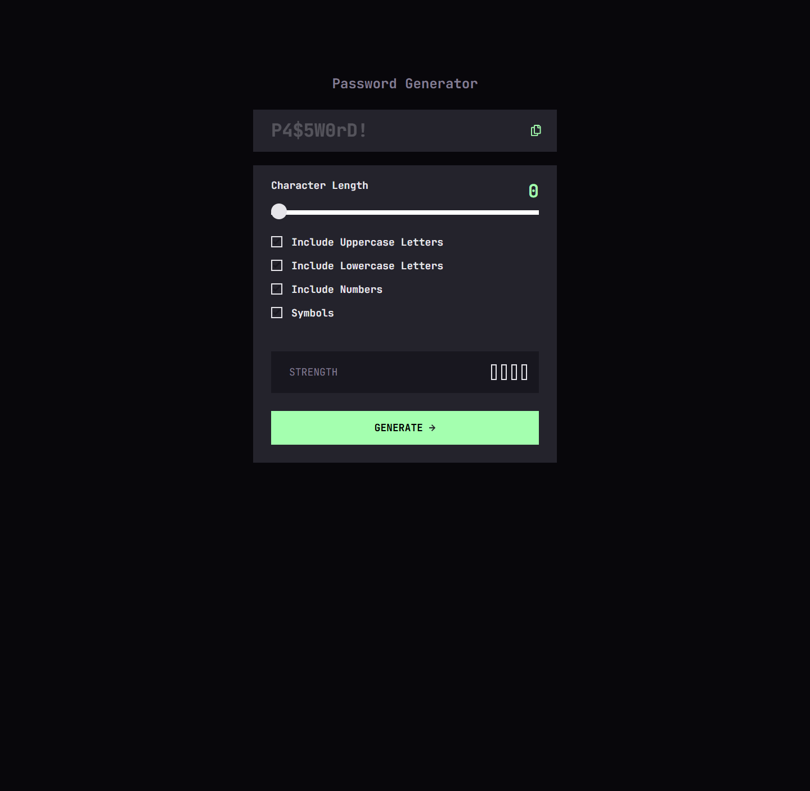

# Frontend Mentor - Password generator app solution

This is a solution to the [Password generator app challenge on Frontend Mentor](https://www.frontendmentor.io/challenges/password-generator-app-Mr8CLycqjh). Frontend Mentor challenges help you improve your coding skills by building realistic projects.

## Table of contents

- [Overview](#overview)
  - [The challenge](#the-challenge)
  - [Screenshot](#screenshot)
  - [Links](#links)
- [My process](#my-process)
  - [Built with](#built-with)
  - [Useful resources](#useful-resources)
- [Author](#author)

## Overview

### The challenge

Users should be able to:

- Generate a password based on the selected inclusion options
- Copy the generated password to the computer's clipboard
- See a strength rating for their generated password
- View the optimal layout for the interface depending on their device's screen size
- See hover and focus states for all interactive elements on the page

### Screenshot

### Links

- Solution URL: [Link](https://olaide-hok.github.io/password-gen-app/)

## My process

### Built with

- Semantic HTML5 markup
- CSS custom properties
- Flexbox
- CSS Grid
- Mobile-first workflow
- JavaScript

### Useful resources

- [The Output element](https://developer.mozilla.org/en-US/docs/Web/HTML/Element/output) - This helped me understand the `<output>` HTML element which is a container element into which a site or app can inject the results of a calculation or the outcome of a user action.
- [input type="range"](https://developer.mozilla.org/en-US/docs/Web/HTML/Element/input/range) - This is an amazing article which helped me understand the `<input>` elements of type range let the user specify a numeric value which must be no less than a given value, and no more than another given value.
- [How TO - Copy Text to Clipboard](https://www.w3schools.com/howto/howto_js_copy_clipboard.asp) - This is an amazing article which helped me understand how to copy text to the clipboard with JavaScript. I'd recommend it to anyone still learning this concept.

## Author

- Website - [Habeeb Kareem](https://habeeb-dev.netlify.app)
- Frontend Mentor - [@olaide-hok](https://www.frontendmentor.io/profile/olaide-hok)
